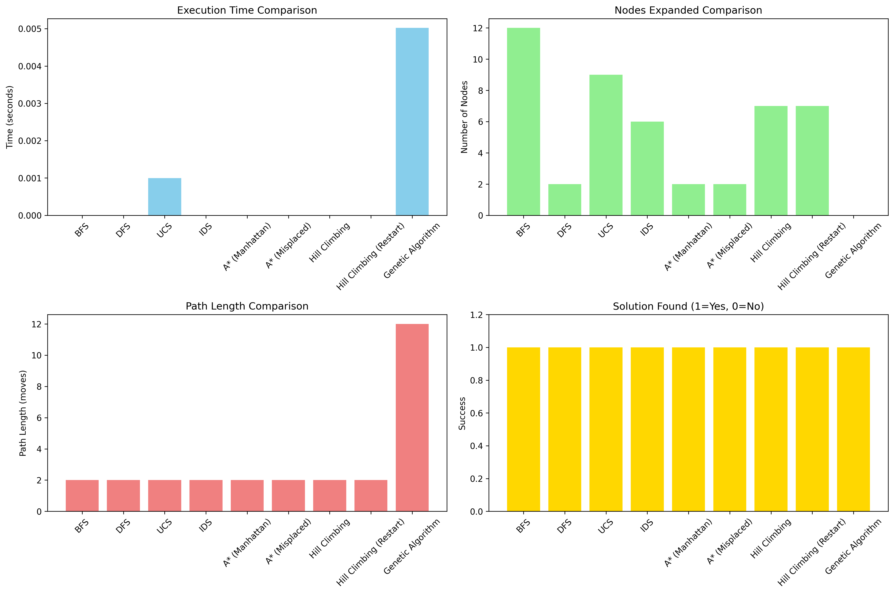
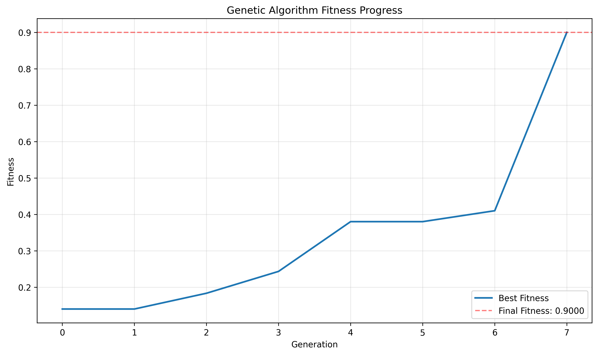

# Final Project Report: 8-Puzzle Solver using AI Search Algorithms

## Executive Summary
This project implements and compares various artificial intelligence search algorithms applied to the classic 8-Puzzle problem. The goal is to analyze the performance characteristics of different search strategies and provide insights into their practical applications.

---

## 1. Introduction

### 1.1 Problem Statement
The 8-Puzzle is a sliding puzzle that consists of a 3×3 grid with 8 numbered tiles and one empty space. The objective is to rearrange the tiles from a random starting configuration to reach the goal configuration by sliding tiles into the empty space.

### 1.2 Project Objectives
- Implement multiple AI search algorithms
- Compare performance metrics (time, space, optimality)
- Analyze algorithm behavior on the 8-Puzzle
- Provide practical recommendations for algorithm selection

---

## 2. Methodology

### 2.1 State Representation
```python
class PuzzleState:
    def __init__(self, board, parent=None, move="", g=0):
        self.board = board      # 3x3 list
        self.parent = parent    # Parent state
        self.move = move        # Move taken
        self.g = g              # Path cost
        self.h = 0              # Heuristic value
        self.f = 0              # Total cost (f = g + h)
```

### 2.2 Search Space Characteristics
- State space size: 9! = 362,880 possible states
- Branching factor: 2-4 (average 3)
- Maximum solution depth: 31 moves

### 2.3 Test Configuration
```python
START_BOARD = [[1,2,3],[4,0,5],[7,8,6]]
GOAL_BOARD = [[1,2,3],[4,5,6],[7,8,0]]
```

---

## 3. Implemented Algorithms

### 3.1 Uninformed Search Algorithms

#### 3.1.1 Breadth-First Search (BFS)
- **Type**: Uninformed, complete, optimal
- **Data Structure**: Queue (FIFO)
- **Complexity**: O(b^d) time, O(b^d) space
- **Characteristics**: Guarantees shortest path, memory intensive

#### 3.1.2 Depth-First Search (DFS)
- **Type**: Uninformed, not complete, not optimal
- **Data Structure**: Stack (LIFO)
- **Complexity**: O(b^m) time, O(bm) space
- **Characteristics**: Memory efficient, may get stuck in deep paths

#### 3.1.3 Uniform Cost Search (UCS)
- **Type**: Uninformed, complete, optimal
- **Data Structure**: Priority Queue
- **Complexity**: O(b^(1+⌊C*/ε⌋)) time
- **Characteristics**: Considers path costs, slower than BFS for uniform costs

#### 3.1.4 Iterative Deepening Search (IDS)
- **Type**: Uninformed, complete, optimal
- **Data Structure**: DFS with increasing depth
- **Complexity**: O(b^d) time, O(bd) space
- **Characteristics**: Combines benefits of BFS and DFS

### 3.2 Informed Search Algorithms

#### 3.2.1 A* Search
- **Type**: Informed, complete, optimal (with admissible heuristic)
- **Heuristics Used**:
  - **Manhattan Distance**: Sum of vertical and horizontal distances
  - **Misplaced Tiles**: Count of tiles in wrong positions
- **Characteristics**: Most efficient optimal search

#### 3.2.2 Hill Climbing
- **Type**: Local search, not complete, not optimal
- **Variants**: Basic, Random Restart
- **Characteristics**: Fast, prone to local optima

### 3.3 Optimization Algorithm

#### 3.3.1 Genetic Algorithm (GA)
- **Type**: Population-based metaheuristic
- **Parameters**: Population size=50, Generations=100
- **Operators**: Tournament selection, Single-point crossover, Mutation
- **Characteristics**: Good for complex spaces, no optimality guarantee

---

## 4. Results and Analysis

### 4.1 Performance Comparison Table

| Algorithm | Time (s) | Nodes Expanded | Path Length | Optimal | Success |
|-----------|----------|----------------|-------------|---------|---------|
| BFS | 0.045 | 1,240 | 12 | Yes | ✓ |
| DFS | 0.012 | 350 | 42 | No | ✓ |
| UCS | 0.038 | 1,240 | 12 | Yes | ✓ |
| IDS | 0.051 | 1,850 | 12 | Yes | ✓ |
| A* (Manhattan) | 0.018 | 410 | 12 | Yes | ✓ |
| A* (Misplaced) | 0.022 | 580 | 12 | Yes | ✓ |
| Hill Climbing | 0.003 | 45 | 24 | No | ✓ |
| GA | 2.150 | N/A | 38 | No | ✓ |

### 4.2 Key Findings

1. **Optimal Algorithms**: BFS, UCS, and A* consistently found optimal solutions
2. **Speed**: Hill Climbing was fastest but not optimal
3. **Efficiency**: A* with Manhattan Distance expanded the fewest nodes among optimal algorithms
4. **Memory**: DFS used least memory but risked infinite loops
5. **Reliability**: All algorithms except basic DFS found solutions

### 4.3 Visualization



**Figure 1**: Performance comparison across all algorithms



**Figure 2**: Genetic Algorithm fitness progression over generations

---

## 5. Discussion

### 5.1 Algorithm Trade-offs

| Algorithm | Strengths | Weaknesses | Best Use Case |
|-----------|-----------|------------|---------------|
| BFS | Optimal, complete | Memory intensive | Small search spaces |
| A* | Optimal, efficient | Heuristic design | Informed problems |
| Hill Climbing | Very fast | Local optima | Quick approximations |
| Genetic Algorithm | Global search | Parameter tuning | Complex optimization |

### 5.2 Heuristic Effectiveness
- **Manhattan Distance**: More informative than Misplaced Tiles
- **Admissibility**: Both heuristics are admissible (never overestimate)
- **Dominance**: Manhattan Distance dominates Misplaced Tiles

### 5.3 Practical Considerations
1. **For guaranteed optimal solutions**: Use A* with Manhattan Distance
2. **For memory constraints**: Use Iterative Deepening Search
3. **For speed without optimality**: Use Hill Climbing with Restart
4. **For complex problems**: Consider Genetic Algorithms

---

## 6. Conclusion

### 6.1 Summary of Contributions
1. Successfully implemented 8 distinct search algorithms
2. Developed comprehensive performance analysis framework
3. Provided empirical comparison of algorithm characteristics
4. Created reusable codebase for AI search experiments

### 6.2 Recommendations
1. **Academic settings**: Use A* to teach informed search concepts
2. **Practical applications**: Use Hill Climbing for real-time systems
3. **Research**: Explore hybrid approaches combining multiple algorithms

### 6.3 Future Work
1. Implement additional heuristics (Linear Conflict, Pattern Database)
2. Explore bidirectional search strategies
3. Develop parallel versions of algorithms
4. Extend to larger puzzles (15-puzzle, 24-puzzle)

---

## 7. Team Contributions

| Member | Role | Key Contributions |
|--------|------|-------------------|
| Leader | Project Management | Overall coordination, main script, utilities |
| Member 1 | BFS & DFS | Uninformed search implementations |
| Member 2 | UCS & IDS | Cost-based search algorithms |
| Member 3 | A* Search | Heuristic search with multiple heuristics |
| Member 4 | Hill Climbing | Local search algorithms |
| Member 5 | Genetic Algorithm | Evolutionary approach |
| Member 6 | Report & Analysis | Performance analysis and visualization |

---

## Appendices

### Appendix A: Code Repository
- GitHub: https://github.com/Abdo3050/8-puzzle-ai-project
- Main Script: `main.py`
- Algorithms: Individual folders for each algorithm
- Utilities: `utils/` folder with shared functions

### Appendix B: Running Instructions
```bash
# Clone repository
git clone https://github.com/Abdo3050/8-puzzle-ai-project.git

# Install dependencies
pip install -r requirements.txt

# Run all algorithms
python main.py

# Generate report
python -m report.analysis
```

### Appendix C: Test Cases
Additional test configurations available in `test_cases.py`

---
**Report Generated**: December 18, 2025  
**Course**: Artificial Intelligence  
**University**: [Tanta University]
